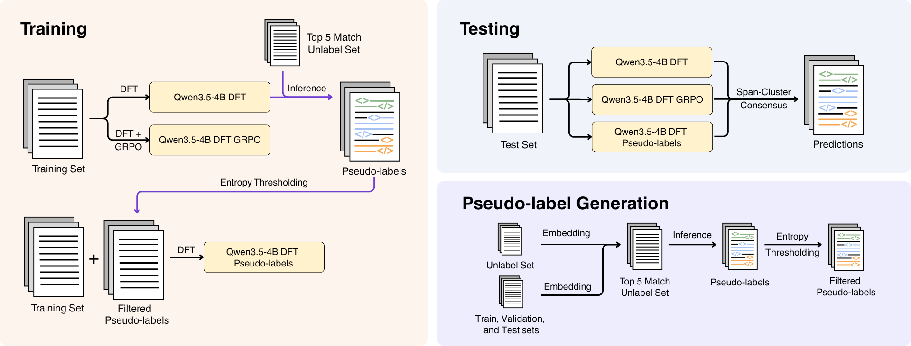

# LAMAR at MedExACT 2026

**Agreement-Driven LLM Ensembles for Clinical Decision Extraction from Discharge Summaries**

2nd place @ MedExACT 2026 · Overall F1: **0.5942** · Token F1: **0.6750** · Span F1: **0.5257**

---

## System Overview

Clinical decision extraction identifies text spans in discharge summaries that express medical decisions and classifies each into predefined categories. We frame this as a generative tagging task — the model rewrites the input with inline XML tags marking each decision span — allowing overlapping spans that BIO-based encoders cannot represent. We fine-tune Qwen3.5-4B under three complementary strategies: Dynamic Fine-Tuning (DFT) with LoRA on the original training set, DFT followed by GRPO reinforcement learning with verifiable rewards, and DFT augmented with entropy-filtered pseudo-labels from 59,201 unlabeled MIMIC-III discharge summaries. At inference time, predictions from all three models are aggregated via **Span-Cluster Consensus**, a greedy MBR approach that clusters overlapping spans by IoU, scores each cluster by inter-model agreement, and refines span boundaries through weighted voting.



We ensemble three Qwen3.5-4B variants trained under complementary strategies:

| Model   | Training   | Description                                      |
| ------- | ---------- | ------------------------------------------------ |
| Model 1 | DFT + LoRA | Dynamic Fine-Tuning on original training set     |
| Model 2 | DFT → GRPO | RLVR (DAPO + GDPO) initialized from Model 1      |
| Model 3 | DFT + LoRA | DFT on training set augmented with pseudo-labels |

Predictions are aggregated via **Span-Cluster Consensus** — a greedy MBR approach that clusters overlapping spans across models, scores clusters by inter-model agreement, and refines boundaries by weighted vote.

---

## Leaderboard

| Rank  | Team               | Span F1    | Token F1   | Base       | Worst F1   | Overall    |
| ----- | ------------------ | ---------- | ---------- | ---------- | ---------- | ---------- |
| 1     | billbaumgartner    | 0.5419     | 0.6667     | 0.6043     | 0.5886     | 0.5965     |
| **2** | **LAMAR (Ours)**   | **0.5257** | **0.6750** | **0.6003** | **0.5881** | **0.5942** |
| 3     | Otter              | 0.5181     | 0.6666     | 0.5924     | 0.5695     | 0.5809     |
| -     | Baseline (RoBERTa) | 0.4363     | 0.6238     | 0.5301     | 0.4922     | 0.5111     |

---

## Implementation Note: DFT on Unsloth

All models are trained using a modified [Unsloth](https://github.com/unslothai/unsloth) library. For **Dynamic Fine-Tuning (DFT)**, we modified the cross-entropy loss kernel to rescale each token's loss by its generation probability (stop-gradient), replacing the standard uniform cross-entropy in SFT.

The modification is in [`unsloth/kernels/cross_entropy_loss.py`](unsloth/kernels/cross_entropy_loss.py).

---

## Project Structure

```
medexact-lamar/
├── scripts/
│   ├── train_dft.py            # DFT training (Model 1 & 3)
│   ├── train_grpo.py           # GRPO training (Model 2)
│   ├── inference.py            # vLLM inference
│   └── push_to_hub.py          # push merged model to HuggingFace Hub
├── ensemble/
│   ├── mbr.py                  # Span-Cluster Consensus
│   └── optimize.py             # Optuna hyperparameter search
├── pseudolabels/
│   ├── extract_unlabel.py      # extract non-MedDec MIMIC-III summaries
│   ├── embedding.py            # embed docs with Qwen3-Embedding-4B
│   ├── retrieve.py             # greedy nearest-neighbor retrieval
│   └── dynamic_threshold.py   # entropy threshold exploration + mixing
├── evaluate/
│   └── evaluate.py             # official shared-task evaluation script
├── baselines/
│   └── train_bert.py           # encoder (RoBERTa/ELECTRA/etc.) baselines
├── utils/
│   ├── gt_to_tag.py            # convert gold JSON annotations → XML-tagged CSV
│   ├── pred_to_offset.py       # convert tagged predictions → character offsets
│   └── rewards.py              # reward functions for GRPO
└── unsloth/                    # modified Unsloth library (DFT loss)
    └── kernels/cross_entropy_loss.py
```

---

## Setup

```bash
pip install -r requirements.txt
```

---

## Usage

### 0. Prepare data

Convert MedDec gold annotations to XML-tagged CSVs for training:

```bash
python utils/gt_to_tag.py \
  --gold_dir path/to/meddec/data \
  --raw_text_csv path/to/raw_text.csv \
  --train_split dataset/train.txt \
  --val_split dataset/val.txt \
  --out_dir dataset/
```

### 1. Train Model 1 — DFT

```bash
python scripts/train_dft.py \
  --model_name Qwen/Qwen3.5-4B \
  --data_path dataset/train.csv \
  --output_dir weights/model1_dft
```

### 2. Generate Pseudo-labels

**2a. Extract unlabeled MIMIC-III summaries (requires NOTEEVENTS.csv access)**

```bash
python pseudolabels/extract_unlabel.py \
  --noteevents path/to/NOTEEVENTS.csv \
  --split_files dataset/train.txt dataset/val.txt dataset/test.txt \
  --output dataset/other_discharge_summaries.csv
```

**2b. Embed all documents**

```bash
python pseudolabels/embedding.py
```

**2c. Retrieve top-5 nearest neighbors**

```bash
python pseudolabels/retrieve.py
```

**2d. Run inference on unlabeled candidates (using Model 1)**

```bash
python scripts/inference.py \
  --model Keetawan/Qwen3.5-4B_LoRA_Exact_BF16_Rank256_Alpha32_DFT \
  --val_out val_model1.csv \
  --test_out other_model1.csv
```

**2e. Explore entropy threshold and mix with training set**

```bash
# Explore thresholds
python pseudolabels/dynamic_threshold.py \
  --pred_other_csv other_model1.csv \
  --pred_val_csv val_model1.csv \
  --gold_dir path/to/meddec/data

# Select threshold and generate mixed training set
python pseudolabels/dynamic_threshold.py \
  --pred_other_csv other_model1.csv \
  --train_csv dataset/train.csv \
  --threshold 0.10 \
  --output_csv dataset/train_with_q10.csv
```

### 3. Train Model 3 — DFT with Pseudo-labels

```bash
python scripts/train_dft.py \
  --model_name Qwen/Qwen3.5-4B \
  --data_path dataset/train_with_q10.csv \
  --output_dir weights/model3_dft_pseudolabel
```

### 4. Train Model 2 — GRPO (initialized from Model 1)

```bash
python scripts/train_grpo.py \
  --model_name Keetawan/Qwen3.5-4B_LoRA_Exact_BF16_Rank256_Alpha32_DFT \
  --data_path dataset/train.csv \
  --output_dir weights/model2_dft_grpo
```

### 5. Run Inference (all 3 models on val + test)

```bash
python scripts/inference.py \
  --model weights/model1_dft \
  --val_out val_model1_dft.csv \
  --test_out test_model1_dft.csv

python scripts/inference.py \
  --model weights/model2_dft_grpo \
  --val_out val_model2_dft_grpo.csv \
  --test_out test_model2_dft_grpo.csv

python scripts/inference.py \
  --model weights/model3_dft_pseudolabel \
  --val_out val_model3_dft_unlabelp10.csv \
  --test_out test_model3_dft_unlabelp10.csv
```

### 6. Ensemble — Optimize Hyperparameters on Val

```bash
python -m ensemble.optimize
```

### 7. Evaluate

```bash
python evaluate/evaluate.py \
  --gold_dir path/to/meddec/data \
  --raw_text_dir path/to/raw_text \
  --stats_csv dataset/stats.csv \
  --split_file dataset/val.txt \
  --predictions predictions/ensemble_val.json
```

### 8. Push to HuggingFace Hub

```bash
python scripts/push_to_hub.py \
  --adapter_path weights/model1_dft \
  --repo_id your-username/your-model \
  --token hf_xxx
```

---

## Citation

```bibtex
@inproceedings{chiewhawan-etal-2026-lamar,
    title = "{LAMAR} at {M}ed{E}x{ACT} 2026: Agreement-Driven Large Language Model Ensembles for Clinical Decision Extraction from Discharge Summaries",
    author = "Chiewhawan, Monrada  and
      Limaroon, Keetawan  and
      Achakulvisut, Titipat",
    booktitle = "Proceedings of the 25th Workshop on Biomedical Language Processing (Shared Tasks)",
    month = jul,
    year = "2026",
    address = "San Diego, California, United States",
    publisher = "Association for Computational Linguistics",
    abstract = "Clinical decision extraction from discharge summaries detects contiguous text spans expressing medical decisions and assigns each to predefined categories. In this paper, we propose an ensemble approach using large language models for clinical decision extraction from discharge summaries in the MedDec dataset with XML-like inline tag annotations. The ensemble consists of Qwen3.5-4B models trained under three different settings: (1) Dynamic Fine-tuning (DFT) with LoRA on the original training set, (2) DFT with LoRA then GRPO reinforcement on the original training set, and (3) DFT with LoRA on the original training set augmented with pseudo-labels. We aggregated predictions for each document by category using weights derived from inter-model agreement. Agreement-driven ensembles further enhanced performance across all metrics, achieving a Span F1 of 0.5257, a Token F1 of 0.6750, and a Worst Group F1 of 0.5881, yielding an Overall F1 of 0.5942 and securing second place on the test leaderboard. Subgroup analysis further confirms that performance remains consistent across demographic groups, with no disproportionate degradation on underrepresented populations. We release our code at https://github.com/biodatlab/medexact-lamar."
}
```
